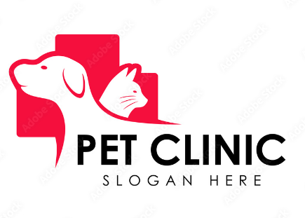

## PROJECT GOAL

  

The study aims to develop and improve the processes used in the pet hospital to 
generate a management system. The goals of this project are to create a system that will 
provide accurate and secure record management and to develop a fast and accurate system 
for medicine inventory. Specifically, it aims to:

1. Develop a **Pet Care Management System** that can:
    - Perform record handling of pet’s information.
    - Monitor pet’s health medication, vaccines, grooming, and consultations.
    - Provide checkup history and detailed pet’s records to the client.

2. Perform inventory of **medicine/drugs** used in pets, including:
    - Providing notification for expired and critical stocks.
    - Generating reports of the pets and inventory.